## 3 команды проверки

```bash
uv run pytest
```

```bash
docker build -t credit-score:1.0 .
docker compose up -d --build
```

```bash
kind create cluster --name credit-score 
kind load docker-image credit-score:1.0 --name credit-score 
kubectl apply -f k8s/ 
kubectl rollout status deploy/credit-score 
kubectl port-forward svc/credit-score 8000:80
```

## Тесты

Запустил командой `uv run pytest`, результат приложен в скрине ниже

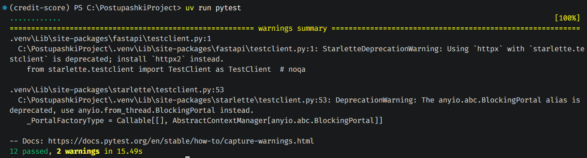

## Логи в базе данных

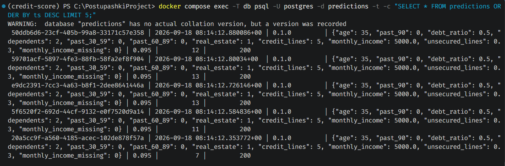

## Оркестрация в K8s

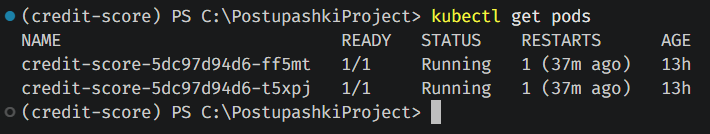

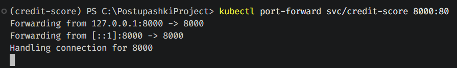

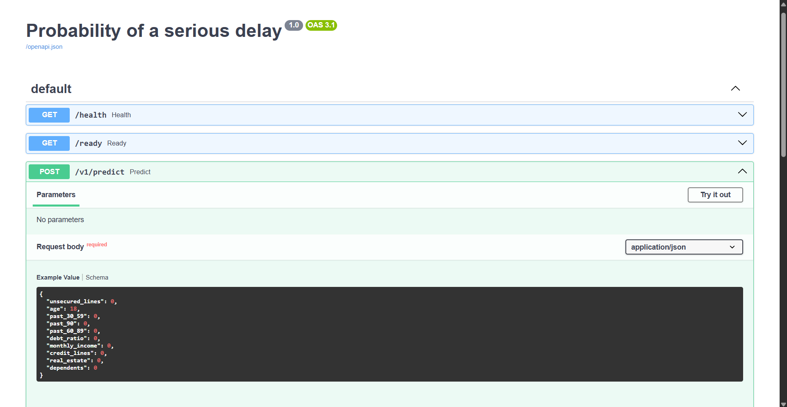

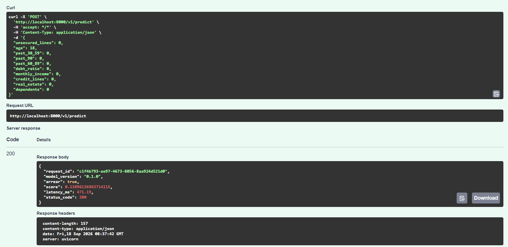

## Нагрузочное тестирование locust

-- run10.csv --

| Type             | RPS   | median | p95 | max    | errors |
| ---------------- | ----- | ------ | --- | ------ | ------ |
| GET /health      | 8.17  | 8      | 26  | 154.56 | 0      |
| POST /v1/predict | 22.00 | 19     | 49  | 240.03 | 0      |
| Aggregated       | 30.17 | 17     | 47  | 240.03 | 0      |

-- run50.csv --

| Type             | RPS   | median | p95 | max    | errors |
| ---------------- | ----- | ------ | --- | ------ | ------ |
| GET /health      | 22.32 | 130    | 390 | 626.36 | 0      |
| POST /v1/predict | 67.00 | 220    | 630 | 946.74 | 0      |
| Aggregated       | 89.33 | 200    | 590 | 946.74 | 0      |

-- run100.csv -- 

| Type             | RPS   | median | p95  | max     | errors |
| ---------------- | ----- | ------ | ---- | ------- | ------ |
| GET /health      | 21.06 | 480    | 900  | 1352.18 | 0      |
| POST /v1/predict | 64.54 | 890    | 1400 | 1860.69 | 0      |
| Aggregated       | 85.60 | 830    | 1300 | 1860.69 | 0      |

При 10 пользователях сервис работает с запасом: p95 (47 мс) отличается от медианы (17 мс) всего в ~2.8 раза, ошибок нет. 

Уже при переходе к 50 пользователям разрыв между p95 и медианой резко растёт (390 мс против 30 мс на 10 пользователях). Здесь начинается очередь на воркерах. 

При этом RPS почти не растёт при переходе от 50 к 100 пользователям (89.3 -> 85.6). Сервис уже упёрся ещё на 50 пользователях, а дальнейшая нагрузка лишь увеличивает время ожидания в очереди (медиана растёт с 200 до 830 мс), а не пропускную способность. 

Ошибок не было ни на одном из трёх прогонов, только растет время ожидания.

## Батч‐эндпоинт с замером

Для проверки написан скрипт scripts/measure_batch.py. Посчитана медиана из десятка повторов

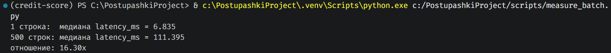

Медиана из 10 повторов: 1 строка = 6.835 мс, 500 строк = 111.395 мс. Батч из 500 строк дороже одиночного запроса всего в 16.3 раз, а не в 500. Причина в том, что sklearn считают предсказание для всей матрицы признаков одним векторизованным вызовом, а не строка за строкой.

## Выкат новой версии и откат

```
kubectl get deploy,svc,pods
kubectl get pods -w
kubectl set image deploy/credit-score api=credit-score:1.1
kubectl rollout status deploy/credit-score
kubectl rollout undo deploy/credit-score
kubectl rollout history deploy/credit-score
kubectl port-forward svc/credit-score 8000:80
```

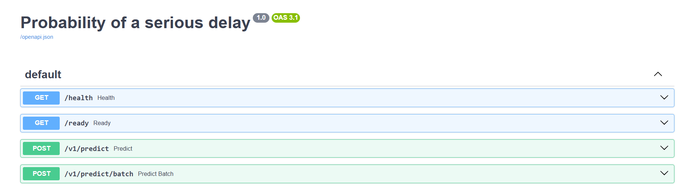

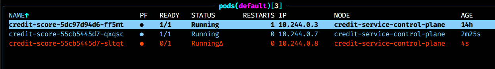

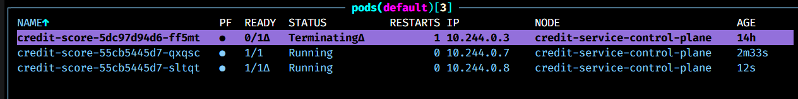

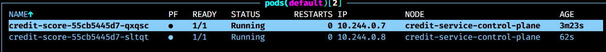

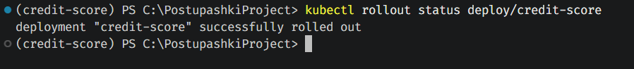
Версия FastAPI действительно поменялась

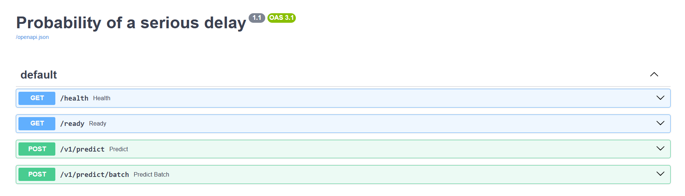

Откат по версии

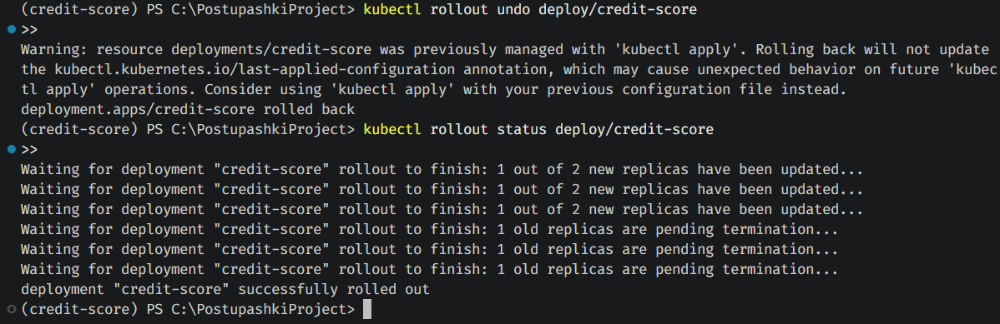

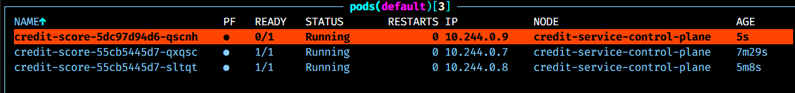

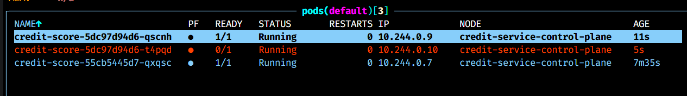

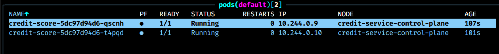

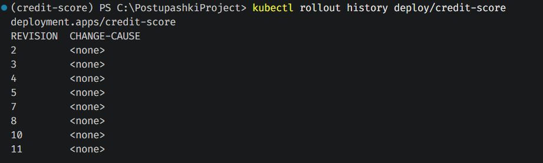

Опять пробросил порт, и версия FastAPI вернулась к 1.0

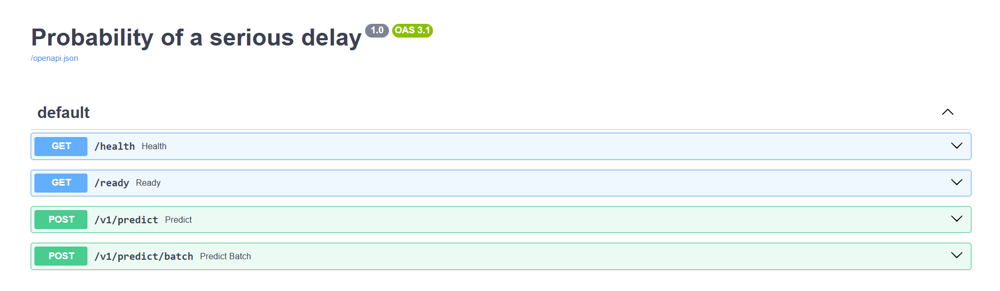

## Журнал проблем

Здесь скорее то, к каким архитектурным решениям я пришел. Не совсем уверен, что правильно их реализовал, поэтому был бы рад фидбеку.

В compose файле при инициализации БД я сделал подключение к ней через переменные окружения (хост, пароль, таблица и пользователь в .env файле). Но это немного усложнило тест работы БД. Для compose postgres лежит по хосту db, для docker файла и подов в k8s по localhost. Поэтому в .yml файле для compose хост задан напрямую (db), остальные параметры из окружения, а в остальных вариантах хост подтягивается из .env и подключается к локалке.

Выглядит немного как костыль, но мне хотелось, чтобы пароль к БД не был указан напрямую в yaml. В k8s это по идее можно было через Secrets сделать, но я не стал.

Логирование (не запись в БД, а в консольке через logger) только в app.py реализовано. Не совсем информативно