# H1 — Домашка 1

## 3 команды проверки

```bash
uv run pytest
```

```bash
docker build -t credit-score:1.0 .
docker compose up -d --build
```

```bash
kind create cluster --name credit-score 
kind load docker-image credit-score:1.0 --name credit-score 
kubectl apply -f k8s/ 
kubectl rollout status deploy/credit-score 
kubectl port-forward svc/credit-score 8000:80
```

## Тесты

Запустил командой `uv run pytest`, результат приложен в скрине ниже

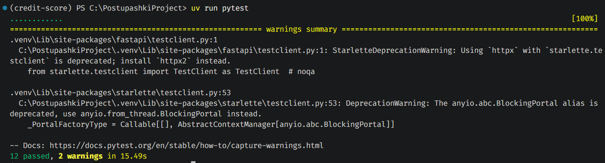

## Логи в базе данных

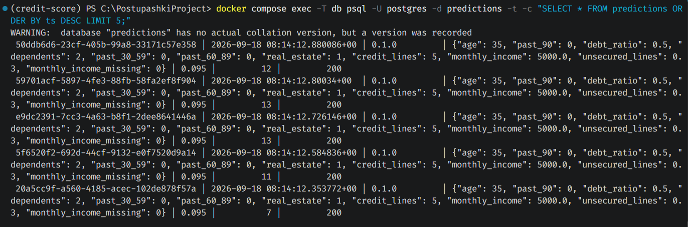

## Оркестрация в K8s

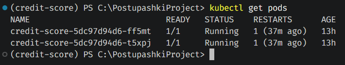

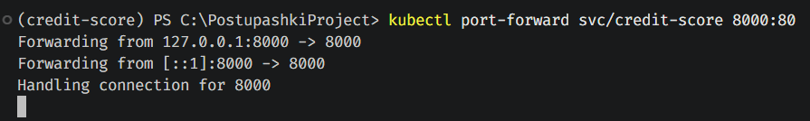

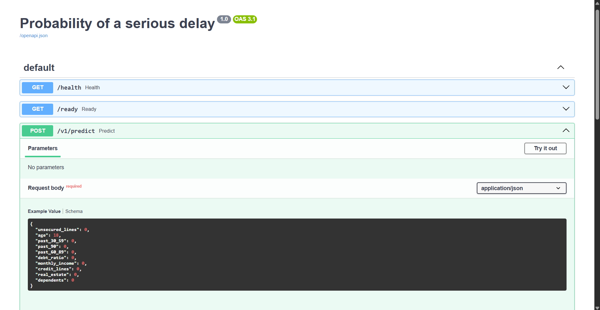

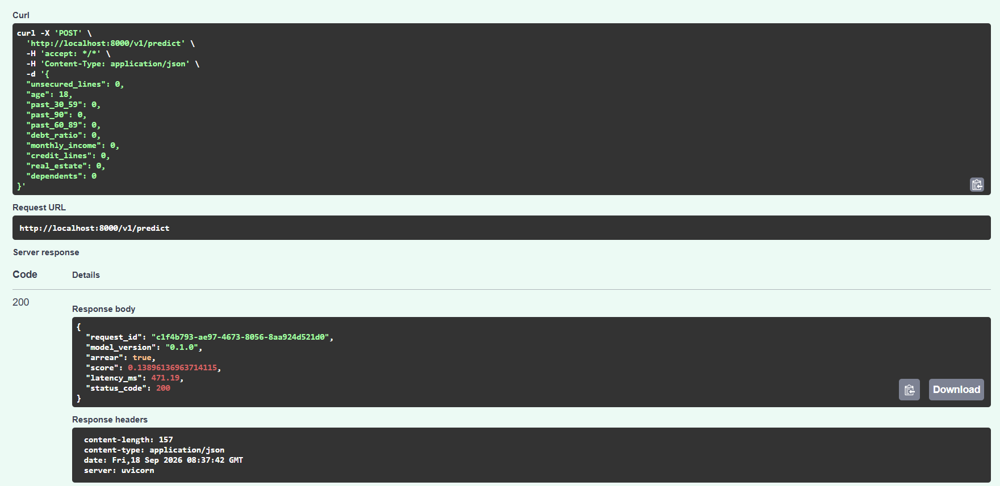

## Нагрузочное тестирование locust

-- run10.csv --

| Type             | RPS   | median | p95 | max    | errors |
| ---------------- | ----- | ------ | --- | ------ | ------ |
| GET /health      | 8.17  | 8      | 26  | 154.56 | 0      |
| POST /v1/predict | 22.00 | 19     | 49  | 240.03 | 0      |
| Aggregated       | 30.17 | 17     | 47  | 240.03 | 0      |

-- run50.csv --

| Type             | RPS   | median | p95 | max    | errors |
| ---------------- | ----- | ------ | --- | ------ | ------ |
| GET /health      | 22.32 | 130    | 390 | 626.36 | 0      |
| POST /v1/predict | 67.00 | 220    | 630 | 946.74 | 0      |
| Aggregated       | 89.33 | 200    | 590 | 946.74 | 0      |

-- run100.csv -- 

| Type             | RPS   | median | p95  | max     | errors |
| ---------------- | ----- | ------ | ---- | ------- | ------ |
| GET /health      | 21.06 | 480    | 900  | 1352.18 | 0      |
| POST /v1/predict | 64.54 | 890    | 1400 | 1860.69 | 0      |
| Aggregated       | 85.60 | 830    | 1300 | 1860.69 | 0      |

При 10 пользователях сервис работает с запасом: p95 (47 мс) отличается от медианы (17 мс) всего в ~2.8 раза, ошибок нет. 

Уже при переходе к 50 пользователям разрыв между p95 и медианой резко растёт (390 мс против 30 мс на 10 пользователях). Здесь начинается очередь на воркерах. 

При этом RPS почти не растёт при переходе от 50 к 100 пользователям (89.3 -> 85.6). Сервис уже упёрся ещё на 50 пользователях, а дальнейшая нагрузка лишь увеличивает время ожидания в очереди (медиана растёт с 200 до 830 мс), а не пропускную способность. 

Ошибок не было ни на одном из трёх прогонов, только растет время ожидания.

## Батч‐эндпоинт с замером

Для проверки написан скрипт scripts/measure_batch.py. Посчитана медиана из десятка повторов

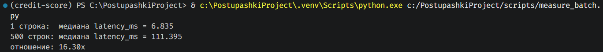

Медиана из 10 повторов: 1 строка = 6.835 мс, 500 строк = 111.395 мс. Батч из 500 строк дороже одиночного запроса всего в 16.3 раз, а не в 500. Причина в том, что sklearn считают предсказание для всей матрицы признаков одним векторизованным вызовом, а не строка за строкой.

## Выкат новой версии и откат

```
kubectl get deploy,svc,pods
kubectl get pods -w
kubectl set image deploy/credit-score api=credit-score:1.1
kubectl rollout status deploy/credit-score
kubectl rollout undo deploy/credit-score
kubectl rollout history deploy/credit-score
kubectl port-forward svc/credit-score 8000:80
```

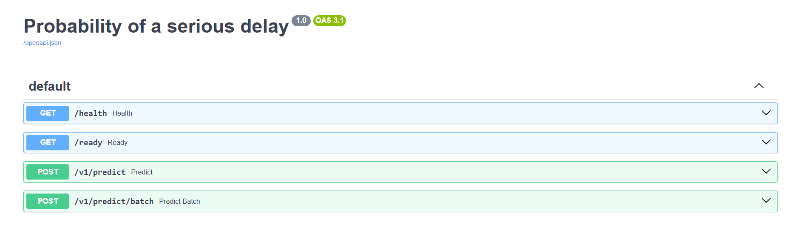

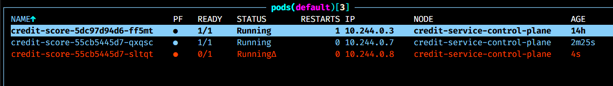

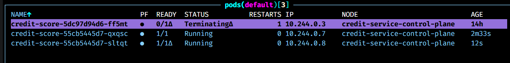

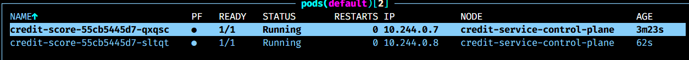

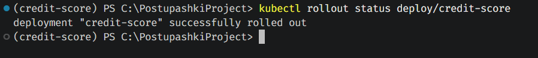
Версия FastAPI действительно поменялась

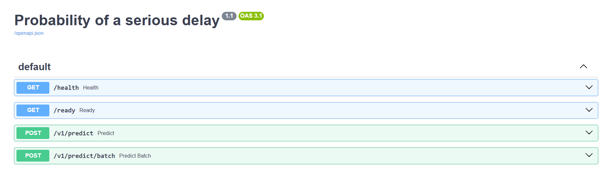

Откат по версии

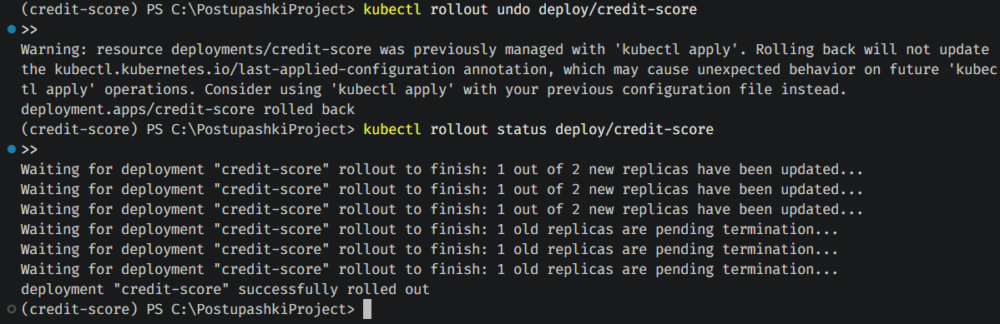

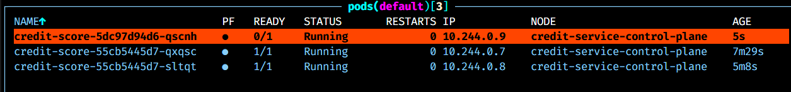

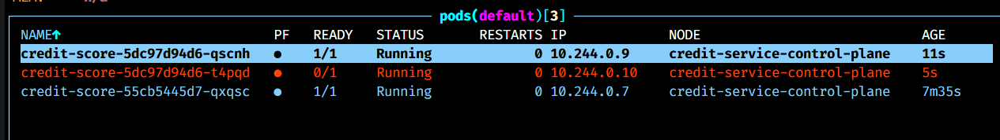

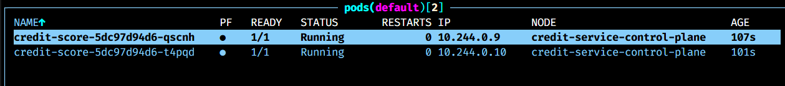

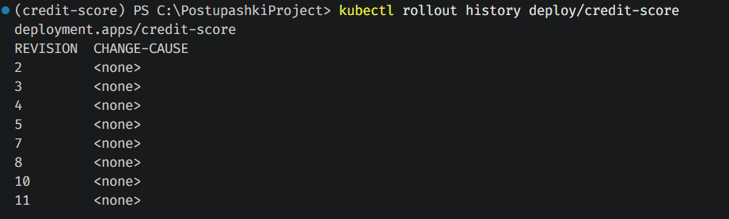

Опять пробросил порт, и версия FastAPI вернулась к 1.0

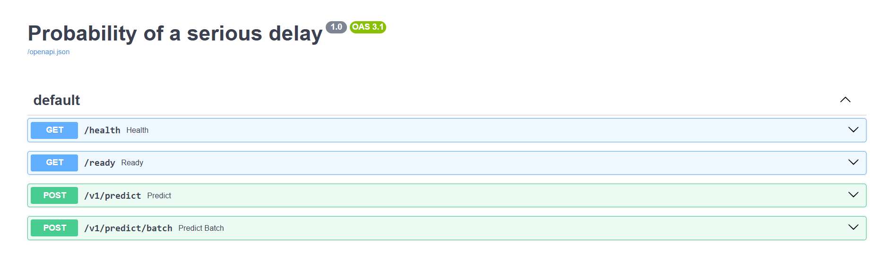

## Журнал проблем

Здесь скорее то, к каким архитектурным решениям я пришел. Не совсем уверен, что правильно их реализовал, поэтому был бы рад фидбеку.

В compose файле при инициализации БД я сделал подключение к ней через переменные окружения (хост, пароль, таблица и пользователь в .env файле). Но это немного усложнило тест работы БД. Для compose postgres лежит по хосту db, для docker файла и подов в k8s по localhost. Поэтому в .yml файле для compose хост задан напрямую (db), остальные параметры из окружения, а в остальных вариантах хост подтягивается из .env и подключается к локалке.

Выглядит немного как костыль, но мне хотелось, чтобы пароль к БД не был указан напрямую в yaml. В первой домашке я тогда не стал настраивать Secret в Kubernetes. Во второй домашке пароль передаётся через GitHub Secret `DB_PASSWORD`, а CI создаёт Kubernetes Secret `credit-secrets`, который Deployment подключает к контейнеру.

Логирование (не запись в БД, а в консольке через logger) только в app.py реализовано. Не совсем информативно

# H2 — Домашка 2: CI/CD

## Реализация пайплайна

Workflow `.github/workflows/ci.yml` запускает `tests` для pull request и push в `master`. Job `tests` поднимает PostgreSQL, запускает Ruff и pytest. На push в `master` после успешных тестов job `build` собирает Docker-образ и публикует его в GHCR с тегом по SHA коммита, а `deploy` создаёт кластер kind, разворачивает PostgreSQL и API, затем выполняет smoke test.

Пароль БД хранится в GitHub Secret `DB_PASSWORD`: workflow создаёт Kubernetes Secret `credit-secrets`, а Deployment импортирует его переменные через `secretRef`. Настройка `LOG_LEVEL` приходит из ConfigMap и возвращается в `/health`. Smoke test посылает реальные признаки, проверяет `0 <= score <= 1` и проверяет, что запрос записан в таблицу. При сбое диагностика собирает Pods, события, `describe` и логи, включая `--previous`.

## Таблица требований и доказательств

| Пункт | Результат | Доказательство |
|---|---|---|
| Три job: tests, build, deploy | Все три завершились успешно в run #20. | [Скриншот run #20](docs/img/hw2_memory_requests_green.jpg); [Actions](https://github.com/harut-prog/credit-score/actions) |
| GHCR-образ с тегом SHA | В run #20 использован `ghcr.io/harut-prog/credit-service:sha-7124af61c8c0eb3149055aeb5c471f043b196d3c`. | [Скриншот с тегом](docs/img/hw2_memory_requests_green.jpg); [страница пакета](https://github.com/harut-prog/credit-score/pkgs/container/credit-service) |
| Pull request: намеренно сломанный тест, затем исправление | Красная проверка показала `assert 200 == 201`; после исправления тесты прошли. На PR `build` и `deploy` ожидаемо пропущены. | [PR #1](https://github.com/harut-prog/credit-score/pull/1); [красная проверка](docs/img/hw2_broken_test.jpg), [ошибка assertion](docs/img/hw2_assertion_error_test.jpg), [зелёная проверка](docs/img/hw2_ci_all_green.jpg) |
| ConfigMap: неверный путь к модели | Run #13 упал при запуске API из-за отсутствующего файла; run #14 после исправления успешен. | [Красный run #13](docs/img/hw2_broken_model_path.jpg), [FileNotFoundError](docs/img/hw2_fake_joblib.jpg), [зелёный run #14](docs/img/hw2_fixed_model_path.jpg) |
| Secret: имя `secretRef` не совпадает с именем созданного секрета | Run #15 упал на rollout; диагностика показала `CreateContainerConfigError`. Run #16 после исправления успешен. | [Красный run #15](https://github.com/harut-prog/credit-score/actions/runs/361100731); [диагностика](docs/img/hw2_secret_ref_red.jpg), [зелёный run #16](docs/img/hw2_secret_ref_fix.jpg) |
| Ресурсы: запрос памяти не помещается на узле | В run #19 диагностика показала Pod в `Pending` и `FailedScheduling` из-за `Insufficient memory`; run #20 после возврата обычных значений успешен. | [Красный run #19 — rollout](docs/img/hw2_memory_request_failed.jpg), [диагностика `Pending` / `Insufficient memory`](docs/img/hw2_failed_scheduling.jpg), [зелёный run #20](docs/img/hw2_memory_requests_green.jpg) |
| Диагностика при сбое | Шаг `Diagnostics` собирает состояние Pods, события кластера и текущие/предыдущие логи контейнеров. | Скриншоты красных runs выше; команды находятся в `.github/workflows/ci.yml` в шаге `Diagnostics`. |

## Семь вопросов

1. В двух первых сравниваемых Actions runs job `build` занял 25 секунд в run #13 и 14 секунд в run #14. Между ними менялись Kubernetes-манифесты, а `Dockerfile`, `pyproject.toml` и `uv.lock` оставались прежними. Поэтому BuildKit мог взять из GHA cache слой установки зависимостей `RUN uv sync --frozen --no-dev --no-install-project`, а также последующие неизменившиеся слои.

2. Эти `ImagePullBackOff` Pods появляются при первоначальном применении `k8s/deployment.yaml`: там стоит шаблонный образ `credit-score:1.0`, которого нет в kind. Следом workflow выполняет `kubectl set image` на SHA-тег из GHCR; новые Pods запускаются, а временные Pods старого ReplicaSet удаляются. Поэтому само наличие переходных Pods в логе ещё не означает провал финального rollout.

3. Пароль задаётся в GitHub Secrets как `DB_PASSWORD`, workflow передаёт его в переменную окружения шага, а `kubectl create secret` сохраняет значение в Kubernetes Secret `credit-secrets` под ключом `POSTGRES_PASSWORD`. Deployment через `secretRef` передаёт этот ключ в контейнер как переменную окружения. В ConfigMap пароль хранить нельзя: ConfigMap предназначен для обычной конфигурации, а не секретных данных.

4. Без `needs: tests` сборка может стартовать параллельно с тестами. Если тесты упадут, build всё равно способен опубликовать образ, а deploy — выкатить его на `master`, поскольку его зависимостью останется build; в результате непроверенная версия попадёт в кластер.

5. На pull request запускается только `tests`, потому что у jobs `build` и `deploy` стоит условие `if: github.ref == 'refs/heads/master'`. Для PR ref имеет вид `refs/pull/.../merge`, поэтому условие ложно. Это не даёт собирать и выкатывать образ из непроверенной ветки PR и не запускает deployment до слияния в `master`.

6. `pg_advisory_xact_lock(12345)` в `db.init()` сериализует инициализацию схемы и автоматически освобождается в конце транзакции. Без блокировки два API-pod могут одновременно начать создавать таблицу в пустой базе; при гонке одна инициализация может завершиться ошибкой, из-за которой соответствующий pod не поднимется. Речь о двух репликах приложения `credit-score`, а не о репликах PostgreSQL.

7. В трёх намеренно сломанных сценариях зафиксированы разные состояния Pod: `Pending` при нехватке памяти (`FailedScheduling` / `Insufficient memory`), `CreateContainerConfigError` при неверном `secretRef` и `CrashLoopBackOff` при несуществующем пути к модели. Это три отдельных сбоя конфигурации, а не последовательные стадии одного Pod. Скрин run #19 подтверждает `Pending` и нехватку памяти; остальные состояния видны в диагностических скриншотах соответствующих запусков.

## Журнал проблем

1. **Тест в PR.** Я временно ожидал статус `201`, но endpoint вернул `200`: pytest показал `assert 200 == 201` и завершился с одним упавшим тестом. Исправил ожидаемый статус на фактический `200`, отправил следующий коммит и дождался зелёной проверки PR.

2. **Неверный путь к модели (runs #13 → #14).** В ConfigMap указал несуществующий путь. В `deploy` сломался rollout, а логи контейнера показали `FileNotFoundError` для `artifacts/no_baseline_be_sure.joblib` и `Application startup failed`. Исправил `MODEL_PATH` на существующий файл модели; следующий запуск завершил `tests`, `build` и `deploy` успешно.

3. **Неверное имя Secret (runs #15 → #16).** Workflow создаёт `credit-secrets`, а в `secretRef` временно было указано `credit-secret`. `Deploy API` не дождался rollout; диагностика показала Pod в `CreateContainerConfigError`. Вернул точное имя `credit-secrets`; следующий run прошёл.

4. **Недоступная память (runs #19 → #20).** Первая попытка с огромным `requests.memory` при `limits.memory: 1Gi` была отклонена Kubernetes API ещё при `kubectl apply`, потому что request превышал limit. Для повторной симуляции я сделал request и limit одинаково большими: манифест применился, rollout завершился таймаутом, а диагностика подтвердила Pod `Pending` и `FailedScheduling` с причиной `Insufficient memory`. Затем вернул `requests.memory: 512Mi` и `limits.memory: 1Gi`; run #20 прошёл все три job.

5. **Контролируемые red/green deploy в HW3.** Все шесть запусков сделаны отдельными последовательными коммитами только в ветке `hw3` по правилу пользователя. Базовый green: [bea7735 / run 37053723403](https://github.com/harut-prog/credit-score/actions/runs/37053723403). Неверный Registry alias: [red 08ebda0 / run 37054105773](https://github.com/harut-prog/credit-score/actions/runs/37054105773) → [green fb3a465 / run 37054829281](https://github.com/harut-prog/credit-score/actions/runs/37054829281). Pod ушёл в `CrashLoopBackOff`, лог MLflow сообщил `Registered model alias no-such-alias not found`; возврат `champion` восстановил rollout.

6. **Неверное имя kind-кластера.** [red 5023388 / run 37055871329](https://github.com/harut-prog/credit-score/actions/runs/37055871329) → [green eaa2ba0 / run 37137311586](https://github.com/harut-prog/credit-score/actions/runs/37137311586). `tests` и `build` прошли, а deploy остановился на `Select existing kind cluster`: `could not locate any control plane nodes for cluster named 'credit-service-missing'`. Исправление env на `credit-service` вернуло доступ к существующему кластеру.

7. **Неверный Ingress host.** [red 42ec761 / run 37137683401](https://github.com/harut-prog/credit-score/actions/runs/37137683401) → [green 3c78e59 / run 37137910217](https://github.com/harut-prog/credit-score/actions/runs/37137910217). Rollout был успешен, но smoke на `/health` получил `HTTP Error 404: Not Found`, потому что запрос шёл с Host `credit.localhost`, а правило временно слушало `wrong-credit.localhost`. Возврат host `credit.localhost` восстановил полный smoke, включая проверку записи в PostgreSQL.

Для исправленных сценариев я сохранял отдельные коммиты: `f3ecaa2` — модель, `6eea4da` — Secret, `7124af6` — память. Первоначальную ошибочную попытку с request больше limit оставил в истории как диагностический шаг, а в отчёте основным ресурсным сценарием указал повтор run #19.

# H3 — Домашка 3: MLOps

## Что запущено и как это проверено

Кластер kind `credit-service` создан с пробросом localhost:80 на NodePort 30080. Traefik направляет `mlflow.localhost` в MLflow, а `credit.localhost` в API. На момент проверки в кластере были готовы MLflow, Traefik, metrics-server, PostgreSQL и две реплики API. HPA установлен с границами 2–6 и порогом 60% CPU. API загружает из Model Registry алиас `champion`, а `/health` сообщает фактическую версию и `run_id`.

Проверка `scripts/smoke_hw3.py` через Ingress вернула `model_source=registry`, `model_version=3`, `score=0.4401357943582565`, `status_code=200`. Запрос с ID `e87965ad-b002-4592-a2b3-26f6225536ec` найден в PostgreSQL с теми же score и версией. Публичная сводка — [report/hw3/evidence.md](report/hw3/evidence.md); исходный ответ сохранён локально в `report/hw3/smoke-local.txt`.

Локальная проверка кода: `ruff check .` прошла, fallback тесты дали 15 passed и 3 skipped без БД; после запуска Compose PostgreSQL три интеграционных теста `-m integrations` прошли. Они проверяют записи для статусов 200, 422 и 500.

| Требование | Факт и доказательство |
|---|---|
| MLflow/Ingress | `mlflow.localhost` открывается в разделе Model training; Registry содержит `credit-score-logreg` версии 1–4. `kubectl get pods,ingress -A` и конфигурация — в `platform/` и `k8s/`. |
| Три запуска и гейт | Локальные логи `report/hw3/train{1,2,3}-fixed.txt`; [сводка](report/hw3/evidence.md). AP на одном validation split: 0.374676525 → 0.369516914 → 0.376070321. Версия 2 отклонена; `champion=3`. Сохраняются параметры, метрики, PR curve, metadata и `data_md5`. |
| Registry и API | `/health` показывает `champion=3`; smoke проверил версию, ответ и точную запись в БД. Loader валидирует состав признаков и threshold, ошибка Registry не маскируется fallback файлом. |
| Git/DVC | V1: `cce525a1d41f234f58d3bb52f3d2516b` (150000 строк); V2: `d7123f735b51ec6675c136a2a944aa25` (149730 строк). [Трансформация](report/hw3/data-v2.txt), [DVC push](report/hw3/dvc-push-v2.txt), [проверка чистого клона](report/hw3/evidence.md), Git V2 `7d56f4e2fe269d88175d7d0e31c4f739edaf6fe4`. `dvc diff 9e2df3a 7d56f4e` показал один изменённый CSV. |
| HPA и нагрузка | [Публичная таблица измерений](report/hw3/evidence.md). Исходные Locust CSV и снимки HPA сохранены локально в `report/hw3/`. |
| Локальный runner и CI | Runner `credit-kind` зарегистрирован для `harut-prog/credit-score`, в сети Docker `kind`; из контейнера доступны `kind`, `kubectl` и узел `credit-service-control-plane`. Workflow применяет Secret, PVC, API и HPA, затем выполняет smoke через Ingress. |

## Обучение и выбор champion

Модель — `Pipeline` с `ColumnTransformer`, пропуски `monthly_income` и `dependents` заполняются внутри pipeline. `add_indicator=True` для дохода создаёт индикатор пропуска в обучении и инференсе одинаково. Строки с кодами 96/98 и нулевым возрастом исключены перед разбиением; исходная маска заключена в скобки, удалено 270 строк. Гейт сравнивает Average Precision кандидата и действующего champion на **одном и том же** validation split и требует улучшения хотя бы на `MIN_GAIN=0.001`. Каждая версия получает `challenger`; `champion` меняется только при прохождении гейта. Выход `train.py` сохраняет номера версий и решение.

Запуск на V2 данных создал Registry version 4, `data_md5=d7123f735b51ec6675c136a2a944aa25` и не повысил champion: после удаления уже отфильтрованных при обучении записей validation AP осталась 0.376070321. Это отдельная версия сырого файла; обучающие строки совпали. У MLflow на Windows при перенаправлении вывода в кодировке cp1251 дополнительно возникал `UnicodeEncodeError` при печати emoji в ссылке на run. Регистрация и финальное JSON-решение завершились, но для чистого лога следующего запуска установлена `PYTHONIOENCODING=utf-8`.

Откат проверен через UI Registry: `champion` перенесён с версии 3 на 1, затем выполнен `kubectl rollout restart deploy/credit-score`. Полный rollout шести реплик занял **21,64 с**; `/health` после него показал `model_version=1`, `run_id=17db9ff516254503b7dced238feff4ab`. Образ до и после был тем же `credit-score:hw3`. Затем через UI `champion` возвращён версии 3, Deployment перезапущен; `/health` снова показал `model_version=3`, `run_id=72327f8482c6423d90815ca32aed949b`. Сразу после второго `rollout status` один запрос Ingress кратко вернул 502; повтор через четыре секунды прошёл. Поэтому для оценки доступности одного `rollout status` недостаточно — нужен фактический HTTP smoke после обновления endpoints.

## HPA и три прогона

Первый прогон при 10 пользователях и CPU request 250m: 7108 запросов, ошибок нет, суммарно 29.77 RPS, p95 `/v1/predict` 83 мс. CPU было около 2% от request, HPA держал две реплики. После этого request CPU уменьшен до 50m в `k8s/deployment.yaml`, чтобы на том же учебном узле увидеть реакцию порога 60%; лимит остался 1 CPU на Pod.

При 30 пользователях HPA выдал `SuccessfulRescale` сначала до 4, затем до 6 реплик. Во время прогона `kubectl top pods` показывал 798–989m CPU и 191–196Mi памяти на Pod, HPA — 1745%/60%. Locust выполнил 11812 запросов, из них один POST получил 502 во время масштабирования; p95 POST 790 мс, суммарно 65.86 RPS. Поэтому здесь нельзя утверждать нулевую долю ошибок: она равна 1/11812 ≈ 0.0085%.

При 60 пользователях HPA оставался на максимуме 6 реплик. CPU был 561–1001m на Pod, память 193–199Mi, HPA — 1349%/60%. Locust выполнил 20120 запросов, из них три POST получили HTTP 502; суммарно 111.92 RPS, p95 POST 1400 мс. Рост RPS по сравнению с 30 пользователями сопровождается ростом задержки и ненулевой долей ошибок 3/20120 ≈ 0.015%. Это предел учебного однопроцессорного кластера/Ingress, а не гарантия отсутствия ошибок при масштабировании.

После остановки 60 пользователей в 22:11:29 MSK HPA вернулся к двум репликам в 22:19:50 — через **8 мин 21 с**. Покадровый журнал — `report/hw3/hpa-scale-down.txt`. Внутри этого интервала я дважды перезапускал Deployment для проверки отката модели; HPA сообщил `ScaleDownStabilized` и краткие ошибки получения метрик от ещё не готовых Pod. Поэтому 8 мин 21 с — наблюдаемое время в этой последовательности, а не чистая оценка стандартного окна стабилизации HPA.

| Пользователи | CPU request | Реплики | RPS всего | p95 POST | Ошибки |
|---:|---:|---:|---:|---:|---:|
| 10 | 250m | 2 | 29.77 | 83 мс | 0 / 7108 |
| 30 | 50m | 2 → 4 → 6 | 65.86 | 790 мс | 1 / 11812 |
| 60 | 50m | 6 (максимум) | 111.92 | 1400 мс | 3 / 20120 |

## Восемь вопросов

1. `tests` и `build` выполняются на GitHub-hosted runner: им нужны исходники, зависимости и право публикации образа, но не локальный Kubernetes. `deploy` выполняется на self-hosted runner в Docker рядом с kind, поскольку кластер за домашним NAT и не имеет публичного API. Альтернативы — VPN/tunnel с контролем доступа или внешний кластер; открывать Kubernetes API в интернет ради домашней работы не нужно.

2. Сеть Docker `kind` даёт runner доступ к адресу control-plane и Ingress из контейнера. Docker socket нужен для `kind export kubeconfig`, `docker pull` и `kind load docker-image`; группа `0` даёт непривилегированному пользователю runner доступ к этому socket. Такой доступ практически эквивалентен управлению Docker-host, поэтому runner выделен только под доверенный репозиторий, а внешние PR должны требовать одобрения до исполнения на нём.

3. Workflow получает `DB_PASSWORD` из GitHub Secret только в окружение шага. `kubectl create secret --dry-run=client -o yaml | kubectl apply -f -` создаёт или обновляет один Kubernetes Secret повторяемо: dry-run готовит объект, apply отправляет его в кластер. Пароль не записывается в Git и не печатается в логах; Deployment и PostgreSQL получают его через `secretRef`/`secretKeyRef`.

4. `challenger` указывает на последнюю проверяемую версию, `champion` — на прошедшую порог качества. Алиас сохраняет стабильное имя для сервиса, а номер версии даёт точное воспроизведение. Перенос `champion` с версии 3 на 1 и restart Pod откатывает модель без нового образа; `kubectl rollout undo` откатывает Kubernetes Deployment (например, код/образ), но само по себе не меняет Registry alias.

5. До первого обучения Registry ещё не содержит `champion`. Под с `MODEL_NAME` не может загрузить модель и не должен сообщать Ready; при таком порядке развёртывания CI завершится ошибкой rollout, а в логах будет ошибка поиска alias. Поэтому сначала запуск обучения и проверка champion в MLflow, затем API/runner. Состояние видно через `kubectl get pods` или k9s и шаг Diagnostics в GitHub Actions.

6. Браузер обращается к localhost:80 с Host `mlflow.localhost`. Порт 80 проброшен при **создании** kind на NodePort 30080; Traefik Ingress выбирает `mlflow` Service по Host, Service ведёт на Pod:5000. Для API аналогично используется Host `credit.localhost`. В MLflow отдельно разрешены нужные host/origin настройки; одно лишь создание Ingress не исправляет отказ приложения из-за проверки Host/CORS.

7. HPA считает утилизацию как используемый CPU / `requests.cpu` и приблизительно рекомендует `ceil(текущие реплики × текущая утилизация / 60%)`, с ограничением 2–6. При 250m и малой нагрузке около 2% было недостаточно для роста; при 50m и 30 пользователях наблюдалось 1745%, поэтому целевое число упёрлось в максимум 6. Спад происходит с задержкой стабилизации HPA, а не сразу после остановки Locust; точное время зафиксировано отдельно ниже.

8. Git хранит код и маленький указатель `.dvc`, DVC remote — содержимое большого CSV. Для восстановления данных конкретного run берём `git_sha` и `data_md5` из MLflow, переключаем Git на этот SHA, выполняем `dvc pull` или `dvc checkout` и сравниваем MD5 файла. Версия модели в Registry связана с `run_id`, поэтому путь Registry version → run → Git/DVC однозначен, если remote сохранён.

## Журнал проблем ДЗ 3

- В первых трёх вызовах обучения загрузчик skops не доверял `numpy.dtype`; затем Windows cp1251 ломал печать ссылки MLflow, а системный proxy мешал `.localhost`. После исправлений три запуска завершились и дали решения гейта; старые логи оставлены для разбора ошибки, рабочие имеют суффикс `-fixed`.
- При 30 пользователях во время роста реплик Ingress один раз вернул 502. Это не ошибка обучения; частота 0.0085%. Дальше сравниваю с прогоном 60 пользователей и проверяю, повторяется ли отказ.
- Local DVC remote `C:\dvc-storage` подходит для соседнего клона на этом компьютере, но не переносится на другую машину без копирования storage или смены remote. Это явно указано в README.
